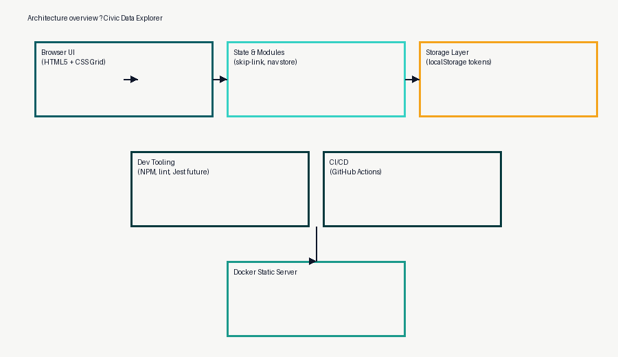

# Civic Data Explorer - Upload 1

search, filter, and visualize Kenya public datasets (budget lines, wards, health facilities) through an accessibility-first prototype.

Civic Data Explorer is a browser-based learning project that demonstrates government data exploration patterns while prioritizing accessibility, responsive layouts, and evidence gathering. Upload 1 focuses on semantic scaffolding, baseline tooling, and the documentation artifacts requested for Week 9.



## Repository structure

- `.github/workflows/lint.yml` - CI pipeline that runs HTMLHint + Stylelint on push/PR.
- `public/` - static site served locally or via Docker. Contains semantic HTML routes, CSS tokens/base layer, JS accessibility helpers, and assets.
- `wireframes/` - low-fidelity PNGs with labeled landmarks and tab order.
- `evidence/` - Lighthouse accessibility report + score screenshot, contrast results, HTML snippets, and mitigation notes.
- `Dockerfile` & `docker-compose.yml` - lightweight Nginx server for parity with deployment targets.

## Prerequisites

- Node.js 20+
- npm 10+
- Docker Desktop (optional, for parity testing)

## Run, lint, and audit

```bash
npm install
npm run dev                 # serves /public at http://localhost:4173
npm run lint                # htmlhint + stylelint
npm run audit:a11y          # bootstraps dev server and runs Lighthouse (accessibility only)
```

### Docker

```bash
docker compose up --build   # serves site at http://localhost:4173
```

## Accessibility checklist (Upload 1)

- Semantic landmarks on `index.html`, `views/data.html`, and `views/form.html` with single `<h1>` per page.
- Skip link reveals on focus and moves keyboard focus to `<main>` (tabindex = -1).
- Keyboard reachability through nav, form controls, disclosure-style menu, and buttons.
- Visible focus states with >= 3:1 contrast (see `evidence/contrast-tokens.png` and `evidence/contrast-notes.md`).
- Color tokens validated at WCAG AA or better and documented in the evidence pack.
- Lighthouse Accessibility score: **100** (report + score screenshot located in `evidence/` along with not-applicable notes).
- No redundant ARIA; only `aria-current` is used for navigation context.
- Responsive grid/flex layout adapts at ~480 px / 768 px / 1024 px without horizontal scroll.
- No color-only indicators; text labels accompany states and controls.

## Performance and security hygiene

- Non-blocking CSS/JS loading plus `prefers-reduced-motion` guard.
- LocalStorage persistence is gated with feature detection to avoid exceptions in hardened browsers.
- Content Security considerations: current build is static (no inline scripts). Future async work will pin `connect-src` to known civic APIs and sanitize templated strings before insertion.
- Docker image uses the official `nginx:alpine` base to minimize attack surface.

## Evidence pack summary (`/evidence`)

| Artifact | Description |
| --- | --- |
| `lighthouse-accessibility.html` | Full HTML report run against the Docker-equivalent build via `npm run audit:a11y`. |
| `lighthouse-score.png` | Score card showing 100/100 accessibility; `lighthouse-notes.md` lists not applicable audits. |
| `contrast-tokens.png` + `contrast-notes.md` | Screenshot + mapping that ties CSS tokens to >= 4.5:1 (text) / >= 3:1 (UI) ratios. |
| `html-snippets.md` | Landmark template, skip link, labeled form group, ARIA usage, and keyboard operable menu toggle. |
| `architecture-diagram.png` | High-level component view linking UI, state store, tooling, and Docker runtime. |

## Wireframes (`/wireframes`)

- `home.png` - landing layout with labeled landmarks and tab order.
- `data.png` - dataset browser view showing filters, cards, and aside tips.
- `form.png` - form-first route with helper text and focus order callouts.

## Data ethics and inclusive UX note

Kenya civic datasets often originate from government open-data portals that may lag in updates or omit informal settlements. Upload 1 mitigates misinterpretation by labeling datasets as sample data and referencing provenance links. Upcoming releases will surface metadata (update cadence, steward) inline, let users report gaps via the feedback form, and pair color cues with iconography/text so that no audience relies solely on hue perception. Particular attention will be paid to representing marginalized counties by highlighting missing data rather than hiding it.

## Next steps toward Upload 2

1. Wire async fetch modules to real Kenya Open Data endpoints with resilient retry/debounce flows.
2. Expand client-side store (classes/modules) to manage filters, bookmarks, and cached API payloads (Web Storage hydration).
3. Layer Jest unit tests around parsing utilities plus add CI job to run tests alongside linting.
4. Add performance budgets (code splitting via dynamic imports) and document DevTools profiling snapshots.
